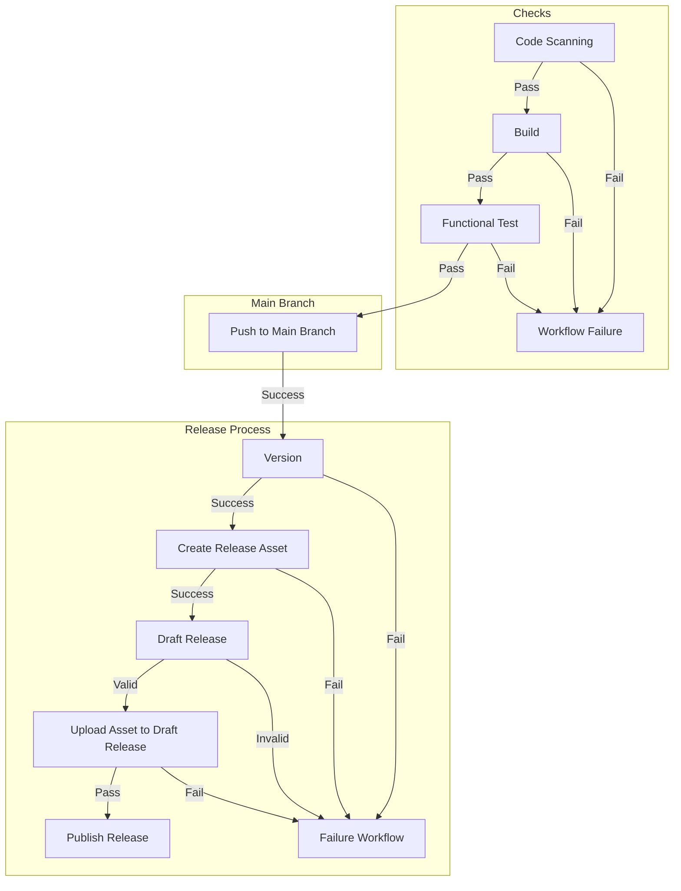

# :test_tube: Review of Workshop Outcomes

So far, we have reached the following milestones, learning to

- [x] Track work on GitHub
- [x] Rapidly onboard onto an existing project
- [x] Work in a collaborative manner, and enable quick incorporation of feedbacks
- [x] Efficiently secure the software supply chain, catching vulnerabilities and non-compliant dependencies as they are introduced
- [x] Automate versioning
- [x] Automate releases
- [x] Implement continuous deployment

## Process Summary

## Observations

Let us observe the outcome of the exercises we have completed as a whole.

1. Navigate to the `Actions` tab and verify the workflows are running (or have completed running).
2. Check the tag was created on the repository.
3. Check the release was created on the repository.
4. Check the release was created on the repository.
